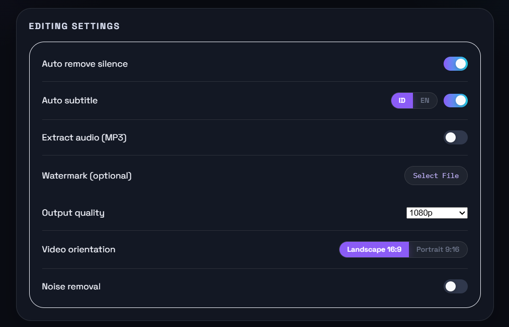
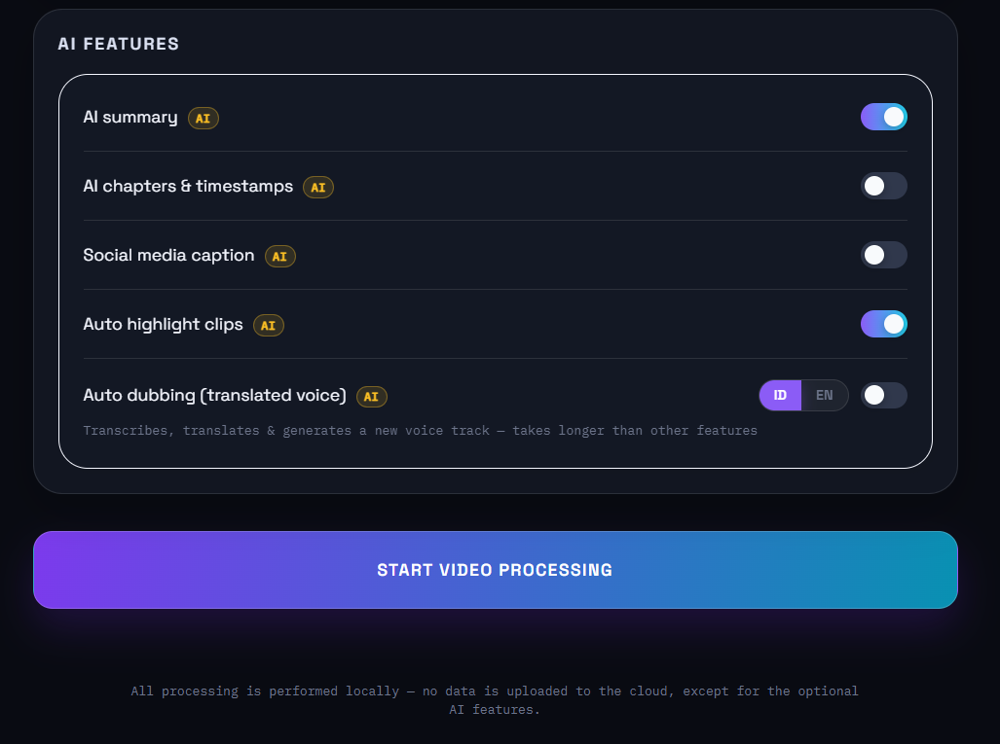
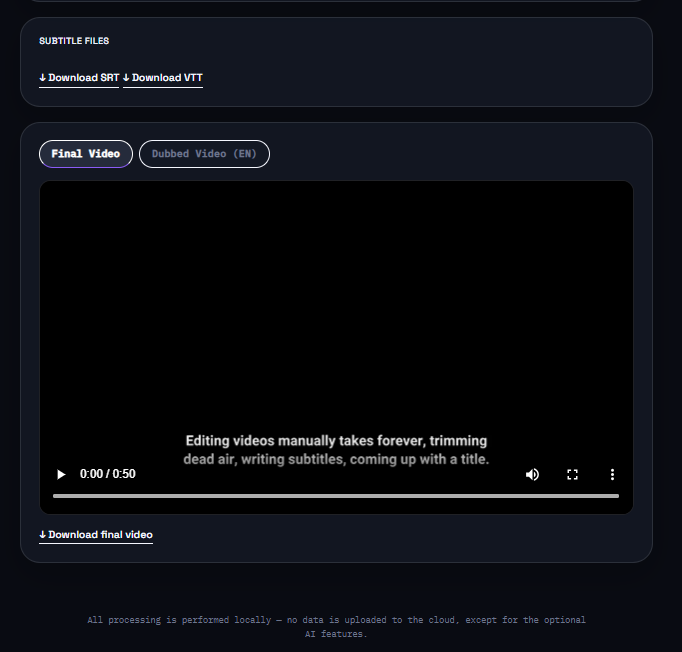
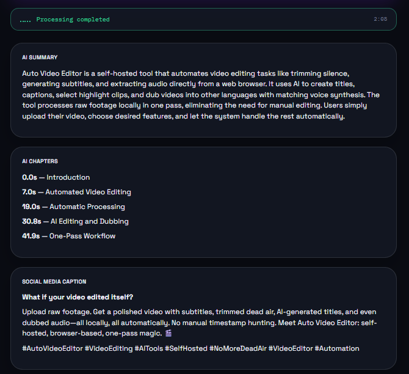

# Auto Video Editor

## About This Project

**Auto Video Editor** is a web application for automating repetitive video editing tasks,
so you don't have to manually edit each clip in tools like Premiere or CapCut. The workflow
is simple: upload a video through the browser, select the features you want, and the system
processes it automatically in the background using `ffmpeg` and `Whisper` (speech-to-text).
The result is playable and downloadable directly from the same page.

Available in 2 forms:

* **Web app** (recommended) — upload a video through the browser, check the features you want, download the result.
* **CLI/batch** — process many videos at once from a folder, no UI.

**Available features:**

1. **Auto silence removal** — detects and cuts out silent or inactive segments of the video
(e.g. long dead air), shortening the video without manually searching for timestamps.
2. **Auto subtitle** — detects the video's original speech language, translates the transcript
to the selected output language, and burns it directly into the video. The web app supports
Indonesian (ID) and English (EN).
3. **Audio extraction (MP3)** — extracts just the audio track as a separate MP3 file, useful
when you only need the audio, e.g. turning a video recording into a podcast (web app).
4. **Watermark** (logo/image) \& **intro/outro** (CLI/batch).
5. **AI summary** — generates a concise 3–5 sentence summary from the video transcript.
6. **AI highlight selection** — automatically selects interesting timestamp ranges and cuts
them into a separate highlight video.
7. **AI chapters \& timestamps** — creates chapter titles with their starting timestamps.
8. **Social media caption generator** — generates a hook, caption, and hashtags for publishing.
These features use an OpenAI-compatible API.
9. **AI auto dubbing** — detects the original speech language, translates the script to the
selected target language (Indonesian or English), generates a new voice track with automatic
male/female voice matching per segment based on the original speaker's pitch, and mixes it
onto the video as an alternate audio track.

**Use case**: ideal for turning raw footage (podcast recordings, webinars, raw clips) into
ready-to-publish content — clean video with dead air removed, subtitles included, a summary,
chapters, social caption, and (optionally) a dubbed version in another language —
with no manual work from scratch.

## Demo Video

> 🎥 **A 1-minute introduction video is on the way — coming soon.**
> Add the demo link here when the introduction video is available.

## Screenshots

The current interface is documented below from upload through AI results:

<table>
  <tr>
    <td align="center" width="50%">
      
      <br><b>1. Upload video</b>
      <br><sub>Select a video and configure the basic processing options.</sub>
    </td>
    <td align="center" width="50%">
      
      <br><b>2. Choose settings</b>
      <br><sub>Enable subtitles, cleanup, output format, and other editing features.</sub>
    </td>
  </tr>
  <tr>
    <td align="center" width="50%">
      
      <br><b>3. Enable AI features</b>
      <br><sub>Choose summary, chapters, social caption, highlights, or dubbing.</sub>
    </td>
    <td align="center" width="50%">
      
      <br><b>4. View processed video</b>
      <br><sub>Play or download the generated video and subtitle files.</sub>
    </td>
  </tr>
  <tr>
    <td align="center" colspan="2">
      
      <br><b>5. Review AI results</b>
      <br><sub>Review the AI summary, chapters and timestamps, and social media caption.</sub>
    </td>
  </tr>
</table>

## AI Setup (required for AI features)

The AI features use the standard OpenAI-compatible API, so they can be pointed at any
compatible AI provider (including free ones) without changing any code — just set these
3 env vars:

* `AI_API_KEY` (required) — API key from your chosen provider
* `AI_BASE_URL` (required) — OpenAI-compatible API endpoint
* `AI_MODEL` (required) — model name supported by that provider
* `MAX_UPLOAD_SIZE_MB` (optional, default: `2048`) — maximum size of each uploaded video or watermark, in MB.

Without all three AI variables, silence removal, subtitles, watermark, resizing, noise removal,
audio extraction, and subtitle downloads still work normally. AI summary, highlights, chapters,
social captions, and dubbing require the variables to be configured. The web upload limit defaults
to 2048 MB per video or watermark. To customize it in Docker, add
`MAX_UPLOAD_SIZE_MB=${MAX_UPLOAD_SIZE_MB}` under `environment` in `docker-compose.yml`, then
set the value in `.env` and recreate the container.

Other providers you can use (just swap `AI_BASE_URL`/`AI_MODEL`/`AI_API_KEY`, no code changes):

* **Cerebras** (default) — `https://api.cerebras.ai/v1` — free, sign up at cloud.cerebras.ai
* **Groq** — `https://api.groq.com/openai/v1` — free, sign up at console.groq.com
* **OpenRouter** — `https://openrouter.ai/api/v1` — many free models, subject to provider and daily limits
* **Together.ai** — `https://api.together.xyz/v1`

> The dubbing feature additionally uses [edge-tts](https://github.com/rany2/edge-tts) (free,
> no separate API key) to generate the new voice track. This means the dubbing feature needs
> outbound internet access from the container even if you're otherwise running everything
> locally — if it's deployed behind a strict firewall, the dubbing step may need that
> outbound access whitelisted.

## Web App (Docker) — recommended

### Prerequisites

* [Docker](https://docs.docker.com/get-docker/) \& Docker Compose installed
* An API key from one of the AI providers (see **AI Setup** above) — optional, but required if you want AI summary, highlights, chapters, social captions, or dubbing

1\. Clone the repo and enter the project folder

```bash
git clone <this-repo-url>
cd smart-video-editor
```

### 2\. Create the `.env` file

Docker Compose automatically reads the `.env` file in the same folder as `docker-compose.yml`.
Copy it from the provided example:

```bash
cp .env.example .env
```

Then edit it to match the provider you're using:

```bash
nano .env
```

```env
AI_API_KEY=your-api-key-here
AI_BASE_URL=https://api.cerebras.ai/v1
AI_MODEL=gpt-oss-120b
MAX_UPLOAD_SIZE_MB=2048
```

> Change `AI_BASE_URL` and `AI_MODEL` to match your chosen provider (see the list above). If
> you don't want to use the AI features yet, `.env` can be left empty — the other features
> still work normally.

### 3\. Build \& run

```bash
docker compose up --build
```

This command will:

* Build the image from the `Dockerfile` (installs Python, ffmpeg, and other dependencies)
* Create the `smart-video-editor` container, exposing port **8000**
* Mount the `./uploads` and `./outputs` folders into the container, so processed files
remain on the host even if the container is removed

To run it in the background (without blocking the terminal):

```bash
docker compose up --build -d
```

### 4\. Access the web app

Open **http://localhost:8000** in your browser → upload a video → choose the features you want
(silence removal, subtitles, SRT/VTT download, noise removal, 720p/1080p output, Landscape 16:9
or Portrait 9:16 format, audio extraction, watermark, AI summary, highlights, chapters, social
caption, or dubbing) → click **"Start Video Processing"**. The page displays detailed stage progress and
provides a Cancel button while processing. Final, highlight, dubbed, and audio results can be
played or downloaded directly.

### Subtitle and dubbing languages

The language buttons are **output-language** choices. The source language of the video is
detected automatically; it is not forced to Indonesian or English. Subtitle language and
dubbing language can be selected independently:

| Source video | Subtitle | Dubbing | Result |
|---|---|---|---|
| English | ID | ID | Indonesian subtitle and Indonesian voice |
| English | EN | EN | English subtitle and English voice |
| Indonesian | EN | EN | English translation and English voice |
| Indonesian | ID | ID | Indonesian subtitle and Indonesian voice |
| Any | EN | ID | English subtitle and Indonesian voice |

AI translation and dubbing require a configured `AI_API_KEY`. Dubbing additionally requires
outbound internet access for `edge-tts` voice generation. Restart or rebuild the application
after changing the code or environment configuration.

Supported video uploads are validated by file extension. The default maximum size is 2 GB per
video or watermark. Files larger than the configured limit return HTTP `413`. The backend accepts
video files supported by the application's security extension list, including common formats such
as MP4, MOV, MKV, AVI, WEBM, and M4V; the exact list is defined in `core/security.py`.

### Other common commands

```bash
docker compose down                        # stop & remove the container
docker compose up --build --force-recreate # full rebuild, force using the latest .env
docker compose exec smart-video-editor env | grep AI_   # check which env vars the container actually sees
docker compose logs -f                     # view real-time logs
```

### Quick troubleshooting

* **`port is already allocated`** — port 8000 is used by another process. Check with
`sudo lsof -i :8000` or change the port in `docker-compose.yml` (e.g. `"8001:8000"`).
* **Error 401 / `Missing Authentication header`** — the API key is wrong or empty. Make sure
`AI_API_KEY` in `.env` matches the provider targeted by `AI_BASE_URL`, then run
`docker compose up --build --force-recreate` so the container picks up the latest `.env`.
* **Env vars in `.env` aren't being used** — if you previously ran `export AI_API_KEY=...`
directly in the terminal, the shell environment takes priority over `.env` for Docker
Compose. Run `unset AI_API_KEY AI_BASE_URL AI_MODEL` and then rerun `docker compose up --build`.
* **Error 402 / `payment_required_error`** — the AI provider's balance/credit is depleted.
Check that provider's billing dashboard, or switch to another provider (e.g. OpenRouter)
in `.env`.
\---

## CLI / Batch mode

For processing many videos at once from a folder without a UI (AI features not included):

### 1\. Installation (one-time)

```bash
sudo apt install ffmpeg          # Ubuntu/Debian
# or: brew install ffmpeg        # Mac
# or download from https://ffmpeg.org for Windows

pip install -r requirements.txt
```

> Note: CLI/batch mode does not include the web-only AI features (summary, highlight, chapters,
> social caption, dubbing) —
> `edge-tts`/`librosa` (used only by the dubbing feature) are still installed via
> `requirements.txt`, but only the web app currently wires the AI features up.

### 2\. Configure editing rules in `config.json`

* **remove\_silence** — automatically cuts out silent/inactive parts of the video
* **subtitle** — generates automatic subtitles from speech and burns them into the video

  * `model_size`: `tiny` (fastest) up to `large-v3` (most accurate, heaviest)
  * `language`: source-language hint for the CLI transcription
  * `output_language`: `"id"` or `"en"` for the subtitle output language
* **intro\_outro** — adds a fixed intro/outro video at the beginning/end
* **watermark** — adds a watermark image (logo, etc.) to a corner of the video

### 3\. Run

```bash
python auto_video_editor.py --input ./raw_videos --output ./processed_videos --config config.json
```

All videos in the `raw_videos` folder (mp4/mov/mkv/avi/webm/m4v) are processed automatically
according to `config.json`, with results saved to `processed_videos`.

\---

## Project Structure

```
smart-video-editor/
├── auto_video_editor.py   - CLI / batch mode entry point
├── config.json            - CLI batch-mode editing rules
├── docker-compose.yml
├── Dockerfile
├── requirements.txt
├── .env.example           - copy to .env and fill in your AI provider config
├── core/
│   ├── editor.py           - video editing logic (silence removal, subtitles, resizing, noise removal, etc.)
│   ├── ai_helper.py         - AI summary, highlights, chapters, and social captions via OpenAI-compatible API
│   └── dubbing.py           - AI auto dubbing (translate, gender-matched TTS voice, mux onto video)
├── web/
│   ├── main.py              - web app backend (FastAPI)
│   └── static/
│       └── index.html        - upload page
└── docs/
    └── pictures/             - screenshots used in this README
```

> `uploads/`, `outputs/`, and `transcript_cache/` are created automatically at runtime (the first
> two are mounted as Docker volumes) and should not be committed to the repository. The web cache
> stores detected-source transcript results keyed by video content and Whisper model so repeated
> processing of the same video is faster.

## Notes

* The web app uses **Balanced mode** by default: Whisper `small`, FFmpeg `veryfast`, and staged
progress reporting. `720p` output is faster than `1080p`; Portrait 9:16 output requires video
re-encoding and may crop the original frame.
* Subtitle processing (speech-to-text) takes time depending on model and video length. Transcript
results are cached for reuse by summary, highlights, chapters, captions, dubbing, and subtitles.
* AI auto dubbing is the slowest feature (transcription + AI translation + TTS generation per
segment + audio muxing) and doesn't lip-sync — mouth movement in the video still follows the
original language. Speaker gender per segment is matched using a rough pitch-based heuristic,
not real speaker identification, so it can misclassify on noisy audio, background music, or
unusual voices; the original background audio/music is replaced entirely by the dubbed track,
not mixed with it.
* Web app jobs are stored in memory (sufficient for personal/small-team use). If you later
need multi-user support with many parallel/queued jobs, this can be extended with a queue
system (Redis/Celery) — just ask if that's needed.
* Uploads are restricted to supported video/image extensions, sanitized to safe basenames, and
  limited by `MAX_UPLOAD_SIZE_MB`. Download paths and job IDs are also validated before files
  are served.
* Cancelling a job is cooperative: the request is recorded immediately and the worker stops at
  the next processing checkpoint. A running FFmpeg or external AI/TTS request may finish before
  cancellation takes effect.

## Tests

Run the dependency-free security tests with:

```bash
python -m unittest discover -s tests -v
```

