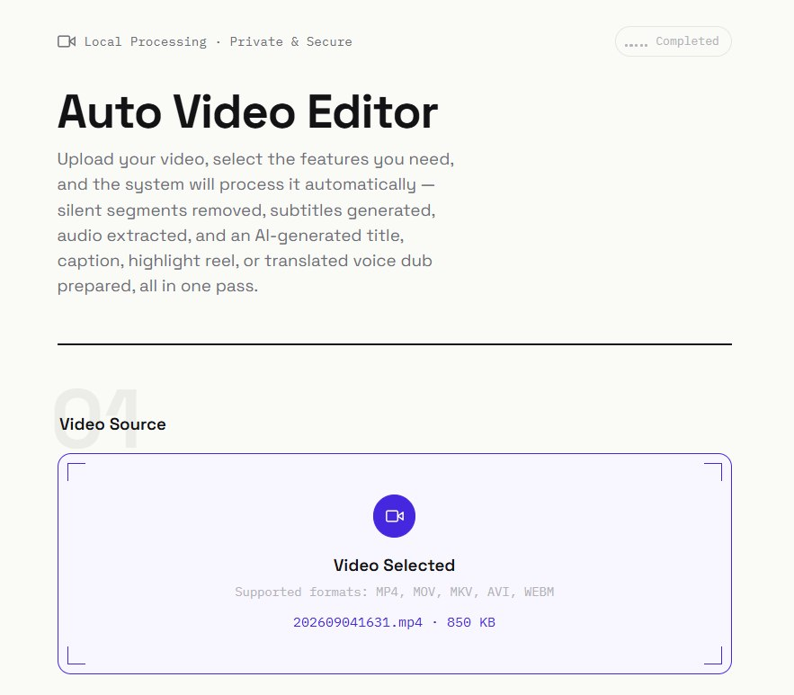
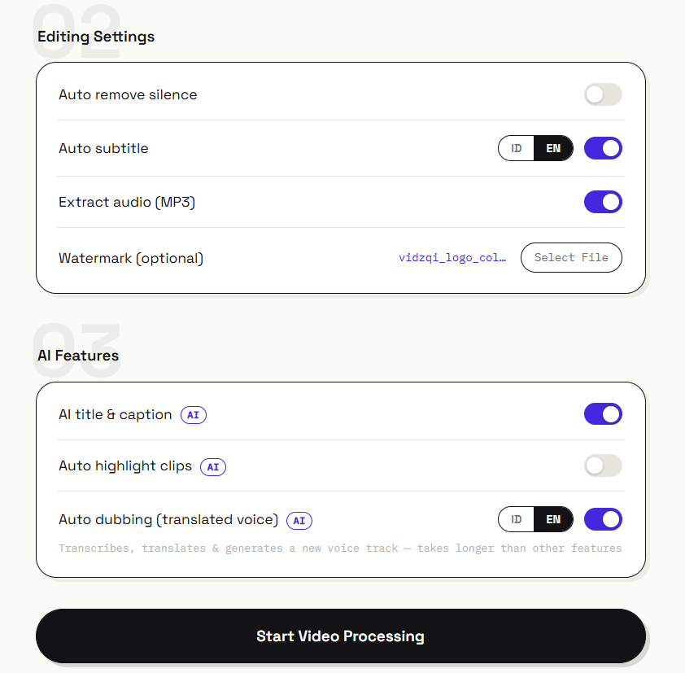
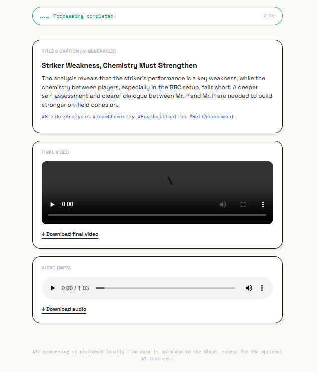

# Auto Video Editor

## About This Project

**Auto Video Editor** is a web application for automating repetitive video editing tasks,
so you don't have to manually edit each clip in tools like Premiere or CapCut. The workflow
is simple: upload a video through the browser, select the features you want, and the system
processes it automatically in the background using `ffmpeg` and `Whisper` (speech-to-text).
The result is playable and downloadable directly from the same page.

Available in 2 forms:

* **Web app** (recommended) — upload a video through the browser, check the features you want, download the result.
* **CLI/batch** — process many videos at once from a folder, no UI.

**Available features:**

1. **Auto silence removal** — detects and cuts out silent or inactive segments of the video
(e.g. long dead air), shortening the video without manually searching for timestamps.
2. **Auto subtitle** — transcribes the video's speech into text and burns it directly into
the video, with a choice of Indonesian or English (web app).
3. **Audio extraction (MP3)** — extracts just the audio track as a separate MP3 file, useful
when you only need the audio, e.g. turning a video recording into a podcast (web app).
4. **Watermark** (logo/image) \& **intro/outro** (CLI/batch).
5. **AI features** — automatic title + caption generation from the video's content, and
automatic highlight selection (cut into separate short clips) — uses an OpenAI-compatible API.

**Use case**: ideal for turning raw footage (podcast recordings, webinars, raw clips) into
ready-to-publish content — clean video with dead air removed, subtitles included, and a
draft title/caption generated automatically, with no manual work from scratch.

## Screenshots

<table>
  <tr>
    <td align="center" width="33%">
      
      <br><b>Upload & Settings</b>
      <br><sub>Upload a video and choose which editing features to apply</sub>
    </td>
    <td align="center" width="33%">
      
      <br><b>AI Features & Processing</b>
      <br><sub>Toggle AI title caption and highlight clips, track live progress</sub>
    </td>
    <td align="center" width="33%">
      
      <br><b>Result</b>
      <br><sub>AI-generated title caption, final video, and audio ready to download</sub>
    </td>
  </tr>
</table>

## AI Setup (required for auto title caption \& highlight features)

The AI features use the standard OpenAI-compatible API, so they can be pointed at any
compatible AI provider (including free ones) without changing any code — just set these
3 env vars:

* `AI_API_KEY` (required) — API key from your chosen provider
* `AI_BASE_URL` (optional, default: Cerebras — free, get one at https://cloud.cerebras.ai)
* `AI_MODEL` (optional, default: `gpt-oss-120b`)

Without `AI_API_KEY`, the silence-removal,subtitle,watermark features still work normally —
only the AI features will be disabled.

Other providers you can use (just swap `AI_BASE_URL`/`AI_MODEL`/`AI_API_KEY`, no code changes):

* **Cerebras** (default) — `https://api.cerebras.ai/v1` — free, sign up at cloud.cerebras.ai
* **Groq** — `https://api.groq.com/openai/v1` — free, sign up at console.groq.com
* **OpenRouter** — `https://openrouter.ai/api/v1` — many free models
* **Together.ai** — `https://api.together.xyz/v1`

## Web App (Docker) — recommended

### Prerequisites

* [Docker](https://docs.docker.com/get-docker/) \& Docker Compose installed
* An API key from one of the AI providers (see **AI Setup** above) — optional, but required if you want the auto title/caption \& highlight features

### 1\. Clone the repo and enter the project folder

```bash
git clone <this-repo-url>
cd transcribe-editor-vidio
```

### 2\. Create the `.env` file

Docker Compose automatically reads the `.env` file in the same folder as `docker-compose.yml`.
Copy it from the provided example:

```bash
cp .env.example .env
```

Then edit it to match the provider you're using:

```bash
nano .env
```

```env
AI_API_KEY=your-api-key-here
AI_BASE_URL=https://api.cerebras.ai/v1
AI_MODEL=gpt-oss-120b
```

> Change `AI_BASE_URL` and `AI_MODEL` to match your chosen provider (see the list above). If
> you don't want to use the AI features yet, `.env` can be left empty — the other features
> still work normally.

### 3\. Build \& run

```bash
docker compose up --build
```

This command will:

* Build the image from the `Dockerfile` (installs Python, ffmpeg, and other dependencies)
* Create the `auto-video-editor` container, exposing port **8000**
* Mount the `./uploads` and `./outputs` folders into the container, so processed files
remain on the host even if the container is removed

To run it in the background (without blocking the terminal):

```bash
docker compose up --build -d
```

### 4\. Access the web app

Open **http://localhost:8000** in your browser → upload a video → check the features you want
(silence removal, subtitle + language, audio extraction, watermark, AI title/caption, AI
highlight) → click **"Start Video Processing"**. The results (final video, highlight, title/caption)
appear directly on the page and can be downloaded.

### Other common commands

```bash
docker compose down                        # stop & remove the container
docker compose up --build --force-recreate # full rebuild, force using the latest .env
docker compose exec auto-video-editor env | grep AI_   # check which env vars the container actually sees
docker compose logs -f                     # view real-time logs
```

### Quick troubleshooting

* **`port is already allocated`** — port 8000 is used by another process. Check with
`sudo lsof -i :8000` or change the port in `docker-compose.yml` (e.g. `"8001:8000"`).
* **Error 401 / `Missing Authentication header`** — the API key is wrong or empty. Make sure
`AI_API_KEY` in `.env` matches the provider targeted by `AI_BASE_URL`, then run
`docker compose up --build --force-recreate` so the container picks up the latest `.env`.
* **Env vars in `.env` aren't being used** — if you previously ran `export AI_API_KEY=...`
directly in the terminal, the shell environment takes priority over `.env` for Docker
Compose. Run `unset AI_API_KEY AI_BASE_URL AI_MODEL` and then rerun `docker compose up --build`.
* **Error 402 / `payment_required_error`** — the AI provider's balance/credit is depleted.
Check that provider's billing dashboard, or switch to another provider (e.g. OpenRouter)
in `.env`.

\---

## CLI / Batch mode

For processing many videos at once from a folder without a UI (AI features not included):

### 1\. Installation (one-time)

```bash
sudo apt install ffmpeg          # Ubuntu/Debian
# or: brew install ffmpeg        # Mac
# or download from https://ffmpeg.org for Windows

pip install -r requirements.txt
```

### 2\. Configure editing rules in `config.json`

* **remove\_silence** — automatically cuts out silent/inactive parts of the video
* **subtitle** — generates automatic subtitles from speech and burns them into the video

  * `model_size`: `tiny` (fastest) up to `large-v3` (most accurate, heaviest)
  * `language`: `"id"` for Indonesian, or `null` for auto-detect
* **intro\_outro** — adds a fixed intro/outro video at the beginning/end
* **watermark** — adds a watermark image (logo, etc.) to a corner of the video

### 3\. Run

```bash
python auto_video_editor.py --input ./raw_videos --output ./processed_videos --config config.json
```

All videos in the `raw_videos` folder (mp4/mov/mkv/avi/webm/m4v) are processed automatically
according to `config.json`, with results saved to `processed_videos`.

\---

## Project Structure

```
core/editor.py        - video editing logic (silence removal, subtitle, watermark, etc.)
core/ai_helper.py      - AI features (title/caption, highlight selection) via OpenAI-compatible API
web/main.py            - web app backend (FastAPI)
web/static/index.html  - upload page
auto_video_editor.py   - CLI / batch mode
Dockerfile, docker-compose.yml - run as a web app
```

## Notes

* Subtitle processing (speech-to-text) takes time depending on `model_size` and video length —
`small` is usually accurate enough and not too slow on a typical CPU.
* Web app jobs are stored in memory (sufficient for personal/small-team use). If you later
need multi-user support with many parallel/queued jobs, this can be extended with a queue
system (Redis/Celery) — just ask if that's needed.

